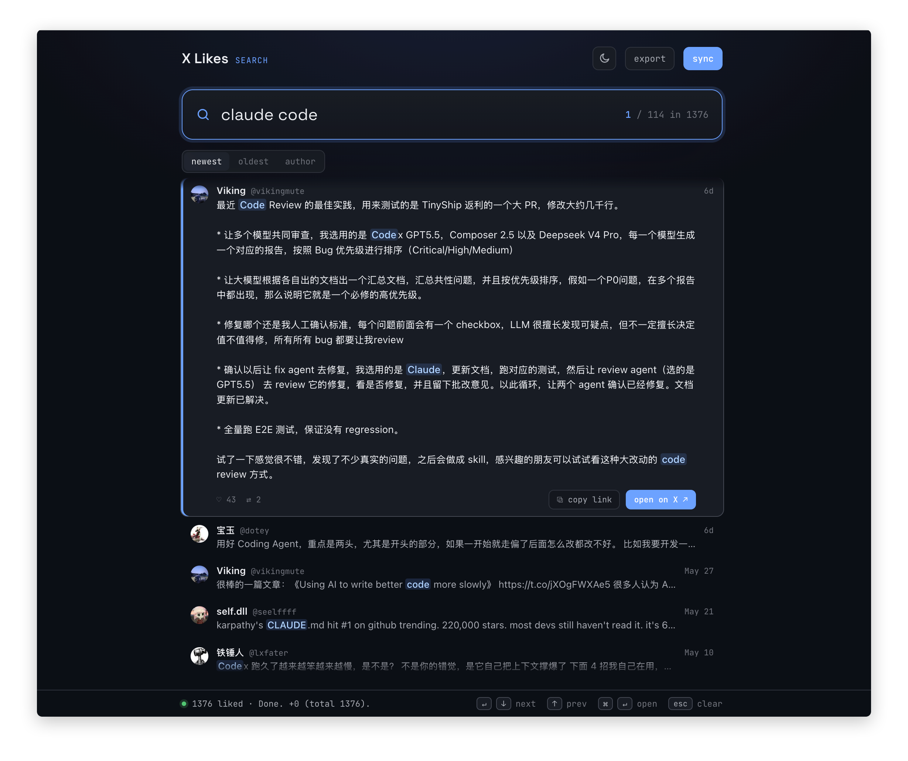

# X Likes Search

[中文说明](README.zh-CN.md)

A Chrome extension for searching tweets you have liked on X / Twitter.

If you use likes as bookmarks, finding an old liked tweet later usually means scrolling your Likes page forever. X Likes Search syncs your liked tweets locally and lets you search them by keyword.

Your data stays in your browser. There is no server, no manual login flow, and nothing is uploaded.



## Install

1. Open the latest release page and download the zip file:
   <https://github.com/liyincode/x-likes-search/releases/latest>
2. Unzip the downloaded file.
3. Open Chrome and go to:
   `chrome://extensions/`
4. Turn on **Developer mode** in the top-right corner.
5. Click **Load unpacked**.
6. Select the unzipped `x-likes-search` folder.
7. Pin the extension icon if you want quick access.

> Chrome may warn you to only install unpacked extensions from trusted sources. This extension runs locally and stores data in your browser.

If you cloned this repo instead, choose the repo folder directly when clicking **Load unpacked**.

## Usage

### First-time setup

1. Open your X Likes page:
   `https://x.com/your-username/likes`
2. Refresh the page once.
   This lets the extension capture the request X uses to load your Likes timeline.
3. Click the **X Likes Search** extension icon in the Chrome toolbar.
4. Click **sync** in the search page to start syncing your liked tweets.

After syncing, you can search your liked tweets directly from the extension page.

### Search liked tweets

- Type in the search box to filter results instantly.
- Search matches tweet text, display names, and usernames.
- Sort by newest, oldest, or author.
- Double-click a tweet card to open the original tweet.
- Click **sync** again later to sync incrementally. Existing tweets are skipped.

## FAQ

### Will my data be uploaded?

No. This extension has no server. Your liked tweets are stored in Chrome's local extension storage.

### Why do I need to open my X Likes page first?

The extension needs to capture the authenticated request your browser already sends to X when loading your Likes page. After that, syncing can run from the extension page, and you do not need to keep the X tab open.

### What if syncing fails?

If you see an auth error, HTTP 403, or a similar failure, the captured request may have expired. Open your X Likes page, refresh it once, then return to the extension page and click **sync** again.

## Notes

- X loads likes through paginated internal APIs, so very old likes may not always be returned completely.
- If X rate-limits the sync, wait a few minutes and try again. Progress is saved as pages are synced.
- If X changes its internal response format, the extension may need an update.

## Development

This is a Manifest V3 Chrome extension with no build step. It can be loaded unpacked as-is.

```bash
npm install
npm run test:unit
npm run test:visual
npm run test:perf
npm test
```

The extension source is plain HTML, CSS, and JavaScript. `feed-core.js` contains the testable, DOM-free logic shared by the UI, service worker, and tests.

## License

[MIT](LICENSE) © Young
