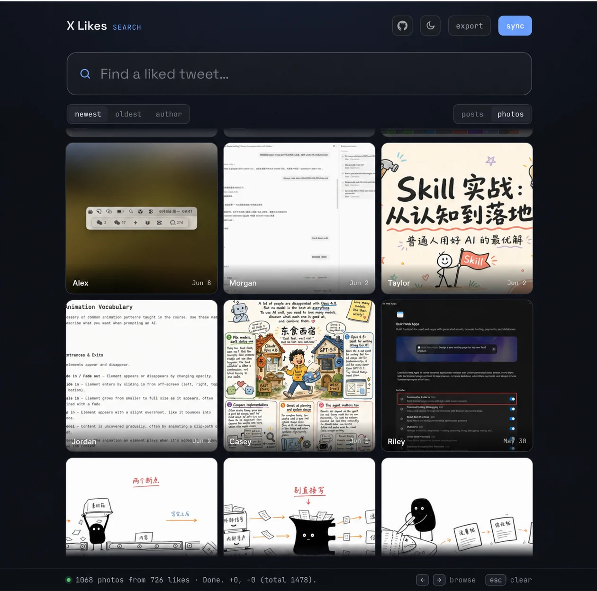

<p align="center">
  
</p>

<h1 align="center">X Likes Search</h1>

<p align="center">
  Search and browse your X / Twitter likes locally.<br>
  Private, fast, and server-free.
</p>

<p align="center">
  <a href="https://github.com/liyincode/x-likes-search/releases/latest"></a>
  <a href="LICENSE"></a>
  
</p>

<p align="center">
  <a href="https://github.com/liyincode/x-likes-search/releases/latest"><strong>Download the latest release</strong></a>
  ·
  <a href="README.zh-CN.md">简体中文</a>
</p>


If you use likes as bookmarks, finding an old post later usually means scrolling forever. X Likes Search builds a private local index so you can find it in seconds, then browse every liked photo in one gallery.

## Features

- **Fast local search** across post text, display names, and usernames.
- **Photo gallery** with responsive browsing, full-size previews, keyboard navigation, single-photo and selected-photo downloads, and links back to X.
- **Safe synchronization** that adds new likes and removes unliked posts only after reaching a verified timeline end.
- **Local-first privacy** with no server, telemetry, or data upload.
- **CSV export** for opening the current results in Excel or Numbers, plus raw JSON export for advanced use.

### Photo gallery in action



## Install

1. [Download the latest release](https://github.com/liyincode/x-likes-search/releases/latest) and get the zip file.
2. Unzip the downloaded file.
3. Open `chrome://extensions/` in Chrome.
4. Turn on **Developer mode** in the top-right corner.
5. Click **Load unpacked**.
6. Select the unzipped `x-likes-search` folder.
7. Pin the extension icon if you want quick access.

> Chrome may warn you to only install unpacked extensions from trusted sources. This extension runs locally and stores data in your browser.

If you cloned this repo instead, choose the repo folder directly when clicking **Load unpacked**.

## Usage

### First-time setup

1. Open your X Likes page: `https://x.com/i/history/likes`.
2. Let the page load once. This lets the extension capture the request X uses to load your Likes timeline; no controls are added to X.
3. Click the **X Likes Search** extension icon in the Chrome toolbar.
4. Click **sync** in the top-right corner of the search page.

The status bar shows the current page and how many likes have been checked. After syncing, you can search your liked tweets or switch to **Photos** to browse liked images.

### Search liked tweets

- Type in the search box to filter results instantly.
- Search matches tweet text, display names, and usernames.
- Sort by newest, oldest, or author.
- Double-click a tweet card to open the original tweet.
- Click **sync** again later to make the local index match your current X Likes. Newly liked posts are added and unliked posts are removed after the timeline has been checked to the end.

### Browse liked photos

- Switch from **Posts** to **Photos** to see every photo from the currently filtered likes.
- Search and sorting apply to the source posts before their photos are shown.
- Click a photo for a larger preview, then use the arrow keys or on-screen controls to move through the full result set. Use the download button in the preview to save that original-size photo.
- Click **select** to choose photos, then **download** to save their original-size files under `Downloads/x-likes-search/`.
- Photos stay linked to their source post, so **open on X** takes you back to the original context.
- After upgrading from a version before `0.5.0`, run sync once to add photo metadata to likes already stored locally.

## How it works

1. When you visit your X Likes page, the extension captures the authenticated Likes request already made by your browser.
2. The extension service worker replays that request directly to X and follows the timeline pagination cursors.
3. Parsed posts and photo metadata are stored in Chrome's local extension storage, where the search page reads them.

The captured request template and indexed likes stay inside the extension. Requests are sent only to X when you start a sync.

## Privacy and permissions

| Permission | Why it is needed |
| --- | --- |
| `storage` | Stores the request template, indexed likes, and sync state locally in Chrome. |
| `unlimitedStorage` | Prevents large local indexes from hitting Chrome's default extension storage quota. |
| `tabs` | Opens or focuses the extension feed, original posts, and the X Likes setup page. |
| `downloads` | Saves only the original-size photos you explicitly download from the preview or gallery selection. |
| Access to `x.com` and `twitter.com` | Captures the Likes request and sends sync requests directly to X. |

- There is no backend server and no telemetry.
- Your password is never read or stored.
- Indexed likes are never uploaded anywhere.
- The authenticated request template is stored only in Chrome's extension storage and used only to communicate with X.

## FAQ

### Will my data be uploaded?

No. This extension has no server. Your liked tweets are stored in Chrome's local extension storage.

### Why do I need to open my X Likes page first?

The extension needs to capture the authenticated request your browser already sends to X when loading your Likes page. After that, syncing can run from the extension page, and you do not need to keep the X tab open.

### What if syncing fails?

If you see an auth error, HTTP 403, or a similar failure, the captured request may have expired. Open `History → Likes`, let it load once, then return to the extension page and click **sync** again. If no request has been captured, clicking **sync** opens the Likes page for you.

## Notes

- X loads likes through paginated internal APIs, so very old likes may not always be returned completely.
- If X rate-limits the sync, wait a few minutes and try again. Progress is saved as pages are synced.
- A sync removes local records that are no longer liked only after it safely reaches the true end of the recognized Likes timeline. Interrupted or partial syncs never delete local data.
- If X changes its internal response format, the extension may need an update.

## Development

This is a Manifest V3 Chrome extension with no build step. It can be loaded unpacked as-is.

```bash
npm install
npm run typecheck
npm run test:unit
npm run test:visual
npm run test:perf
npm test
```

The extension source is plain HTML, CSS, and native ES modules. TypeScript checks every runtime JavaScript module through JSDoc without emitting build artifacts; Chrome still loads the source files directly with no bundler or generated `dist/` directory.

Security reports should follow the private disclosure process in [SECURITY.md](SECURITY.md).

## License

[MIT](LICENSE) © Young
